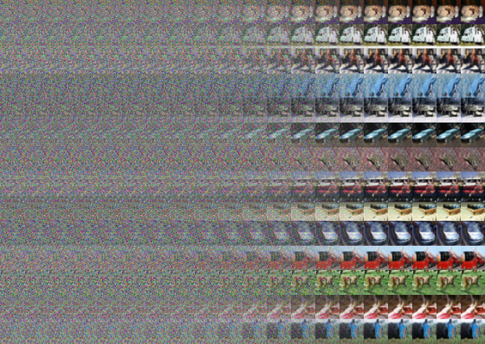

# Diffusion Transformer (minDiT)

[](https://www.python.org/)
[](https://pytorch.org/)
[](./LICENSE)

Implementation of the Diffusion Transformer model (DiT) from the paper:

> [Scalable Diffusion Models with Transformers](https://arxiv.org/abs/2212.09748)

Official PyTorch implementation by Facebook Research: [DiT](https://github.com/facebookresearch/DiT)

---

## Table of Contents

- [Preview](#preview)
- [Dependencies](#dependencies)
- [Training minDiT](#training-mindit)
- [Implementation Notes](#implementation-notes)
- [Todo](#todo)

---

## Preview


### Sample Outputs

**minDiT (39.89M parameters) on CIFAR-10:**



**minDiT on CelebA:**


**More Samples:**


---

## Dependencies

- Python 3.9
- PyTorch 2.1.1
- Other standard libraries: `torchvision`, `numpy`, `PIL`, `scipy`, `tqdm`, `matplotlib`

---

## Training minDiT

Run the training script and specify the dataset path:

```bash
python train.py --data_dir=./data/
